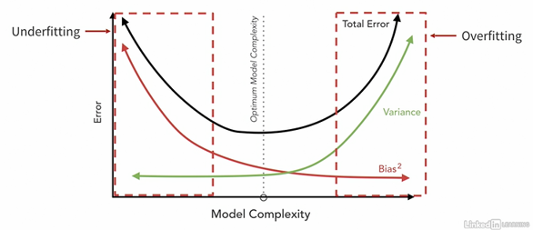
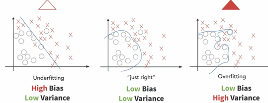

# Applied-Machine-Learning (Self Notes)
Machine Learning on titanic dataset

# First step is to perform Exploratory Data Analysis on dataset
## Why?
* To understand the shape of data
* Learn which features might be useful
* Inform the cleaning that will come next

## What?
* Counts or distributions of all variables
* Data type for each variable
* Missing Data
* Correlation
* Duplicates

# Measuring the success
Fitting a function to examples and using that function to generalize and make predictions about new examples.

## How do we split up our data?
* Training Dataset - data used to train the model (allow algorithm to learn from this data)
* Validation Set - data used to select the best model (optimal algorithm & hyperparameter settings)
* Test Dataset - data used to provide an unbiased evaluation of what the model will look like in its real environment.

## Risk of not Splitting up the full dataset
* Overfitting or underfitting to the data
* Inaccurate representation of how the model will generalize.

## Evaluation Matrix 
Here we are defining weather people survied or not i.e. it's a classification problem. So, here we use three commonly used evaluation matrix.
* Accuracy = # predicted correctly / total # of examples
* Precision = # predicted as surviving that actually survived / total # predicted to survive
* Recall = # predicted as surviving that actually survived / total # that actually survived

# Optimizing a model
## Bias & Variance tradeoff

### Bias
* **Bias** is the algorithm's tendency to consistently learn the wrong thing by not taking into account all the information in the data.
* **High bias** is a result of the algorithm missing the relevant relations between features and target output.
* ** Underfitting** occurs when an algorithm cannot capture the underlying trend of the data.

### Variance
* **Variance** refers to an algorithm's sensitivity to small fluctuations in the training set.
* **High variance** is a result of the algorithm fitting to random noise in the training dataset.
* **Overfitting** occurs when an algorithm fits too closely to a limited set of data.

**Total error = (Bias + Variance)+ Irreducible error**

### How you can diagnose underfit v/s overfit 

## Two ways to tune model for optimal complexity
* **Hyperparameter tuning** - choosing a set of optimal hyperparameters for fitting an algorithm. A **parameter** is estimated from the data whereas a **model hyperparameter** is value external from the model, whose value cannot be estimated from the data but whose value guides how the algorithm learns parameter values from the data.
* **Regularization** - technique used to reduce overfitting by discouraging overly complex models in some way. **Goal** - Allow enough flexibility for the algorithm to learn the underlying patterns in the data but providing guardrails so it does't overfit.

#### Examples of regularization:
* Ridge Regression & lasso regression - adding a penalty to the loss function to constrain coefficients.
* Dropout - some nodes are ignored during training which forces the other nodes to take on more or less responsibility for the input/output.

## Lets give a look to different hyperparameters in the dataset

